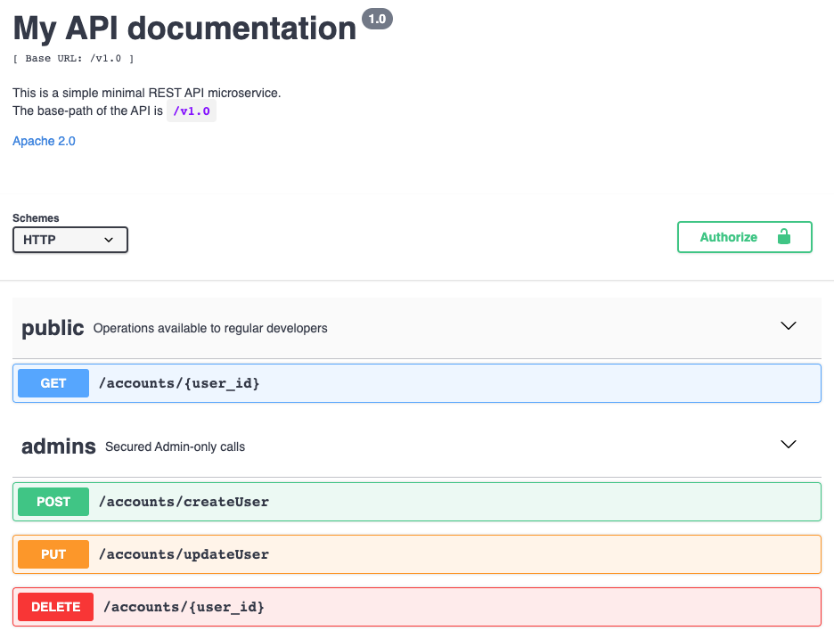

# Minimal REST API Microservice Boilerplate

A minimal REST API microservice in python built with Flask.

(Flask, connexion, openAPI, Swagger)

- [Flask](https://github.com/pallets/flask)
- [Flask-Injector](https://pypi.python.org/pypi/Flask-Injector)
- [Connexion](https://github.com/zalando/connexion)


A small microservice API database wrapper



Project Organization
------------

    |
    ├── /account-microservice
    │   ├── /api       
    |   |   ├── __init__.py                         <- Python init file
    |   |   └── accounts.py                         <- Python file where methods are injected in the API
    │   ├── /providers       
    |   |   └── MongoProvider.py                    <- Python file where methods are implemented
    │   ├── /swagger       
    |   |   └── accounts-service-docs.yaml          <- API Swagger file
    │   ├── app.py                                  <- Main python file to run the app
    │   ├── Dockerfile                              <- Dockerfile used to build the image of the microservice
    │   └── requirements.txt                        <- Requirements file with the list of the libraries needed
    │
    ├── /img                                        <- Folder containing the images for this README file
    ├── LICENSE                                     <- License file
    ├── README.md                                   <- This Readme file
    └── docker-compose.yml                          <- Docker compose file, used to run the microservice
     
--------


# Run the microservice
Run the following command in the root folder of the project (need docker and docker-composed installed).
```
docker-compose up
```

# Consult the API documentation
To consult the API documentation just type the following address in a browser.
```
http://localhost:2020/v1.0/ui/
```

**Endpoints available at `http://localhost:2020/v1.0/{URI}`**:

|Method|URI|Description|
|------|---|-----------|
| GET | /accounts/{user_id} | Retrive infos from the database given an id |
| POST | /accounts/createUser | Insert data into the DB |
| PUT | /accounts/createUser | Update data in the DB |
| DELETE | /accounts/{user_id} | Delete a data from the DB | 

# Customize the microservice